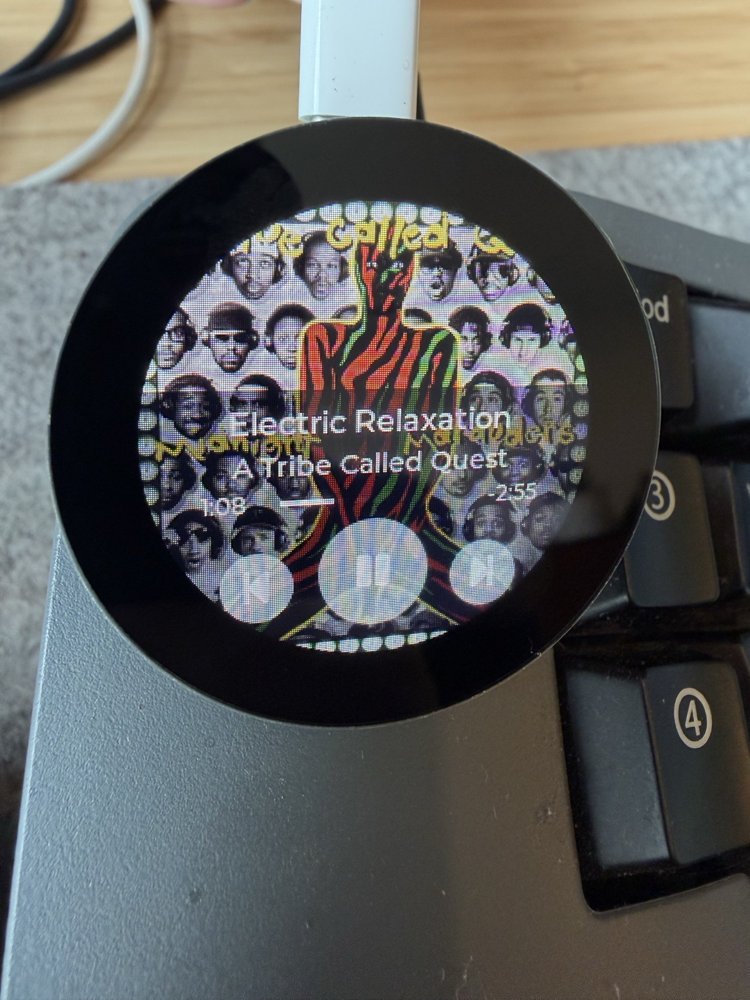

# Now Playing

A macOS "now playing" display for the Seeed XIAO ESP32-C6 round screen. Shows album art, track info, progress, and playback controls on a 240x240 circular TFT — connected over USB.

<p align="center">
  
</p>

## How it works

```
┌──────────┐  USB serial   ┌────────────────┐  nowplaying-cli  ┌─────────────┐
│ ESP32-C6 │ ◄──────────── │  Menu bar app  │ ◄─────────────── │ Apple Music │
│  display │ ──────────────►│   (Mac side)   │ ────────────────►│  / Spotify  │
└──────────┘  touch cmds    └────────────────┘  media controls  └─────────────┘
```

The Mac reads now-playing metadata via `nowplaying-cli`, converts artwork to RGB565, and pushes everything to the ESP32 over USB serial. Touch input on the display sends prev/toggle/next commands back.

## Hardware

- [Seeed XIAO ESP32-C6](https://www.seeedstudio.com/Seeed-Studio-XIAO-ESP32C6-p-5884.html)
- [Seeed Round Display for XIAO](https://www.seeedstudio.com/Seeed-Studio-Round-Display-for-XIAO-p-5638.html) (GC9A01A 240x240 + CHSC6X touch)

## Setup

### Mac

> **Required dependency:** the bridge shells out to [`nowplaying-cli`](https://github.com/kirtan-shah/nowplaying-cli) to read media metadata from macOS. macOS gates `MediaRemote.framework` access by binary path/identity, so a copy at any other location returns empty data — meaning `nowplaying-cli` **must be installed via Homebrew at its default location** and can't be bundled into the .app.

```bash
brew bundle                # installs nowplaying-cli + python
python -m venv .venv
source .venv/bin/activate
pip install -r requirements.txt
```

### Firmware

Requires [ESP-IDF](https://docs.espressif.com/projects/esp-idf/en/stable/esp32c6/get-started/) v5.1+.

```bash
cd firmware/esp-idf
idf.py set-target esp32c6
idf.py build flash
```

On first boot the display shows a QR code. Once the Mac-side bridge connects, it switches to the now-playing UI.

## Running

### Menu bar app (recommended)

```bash
python menubar_app.py
```

Shows a status icon in the menu bar. Auto-detects the ESP32 via USB handshake and reconnects if unplugged/replugged.

### Standalone bridge

```bash
python serial_bridge.py              # auto-detect
python serial_bridge.py /dev/cu.usbmodemXXXXX  # explicit port
```

### Browser UI

```bash
python server.py
# open http://localhost:8787
```

A browser version of the same UI, useful for development without the hardware.

## Packaging the menu bar app

Build a signed, notarized `.app` bundle:

```bash
pip install py2app
python setup.py py2app

# sign
codesign --deep --force --options runtime --timestamp \
  --sign "Developer ID Application: YOUR NAME (TEAMID)" \
  "dist/Now Playing Bridge.app"

# sign nested binaries individually for notarization
find "dist/Now Playing Bridge.app" -type f \( -name "*.so" -o -name "*.dylib" \) \
  -exec codesign --force --options runtime --timestamp \
  --sign "Developer ID Application: YOUR NAME (TEAMID)" {} \;
codesign --force --options runtime --timestamp \
  --sign "Developer ID Application: YOUR NAME (TEAMID)" \
  "dist/Now Playing Bridge.app"

# notarize
ditto -c -k --keepParent "dist/Now Playing Bridge.app" "dist/NowPlayingBridge.zip"
xcrun notarytool submit "dist/NowPlayingBridge.zip" \
  --keychain-profile "your-profile" --wait
xcrun stapler staple "dist/Now Playing Bridge.app"
```

## USB protocol

The Mac and ESP32 communicate over USB serial with a simple binary protocol:

| Direction | Header | Payload |
|-----------|--------|---------|
| Mac → ESP | `0x00` | Ping (ESP responds `NP:ACK\n`) |
| Mac → ESP | `0x01` + 2-byte BE length | JSON state |
| Mac → ESP | `0x02` + 4-byte BE length | RGB565 artwork (240×240) |
| ESP → Mac | `CMD:<action>\n` | Touch command (toggle/next/previous) |
