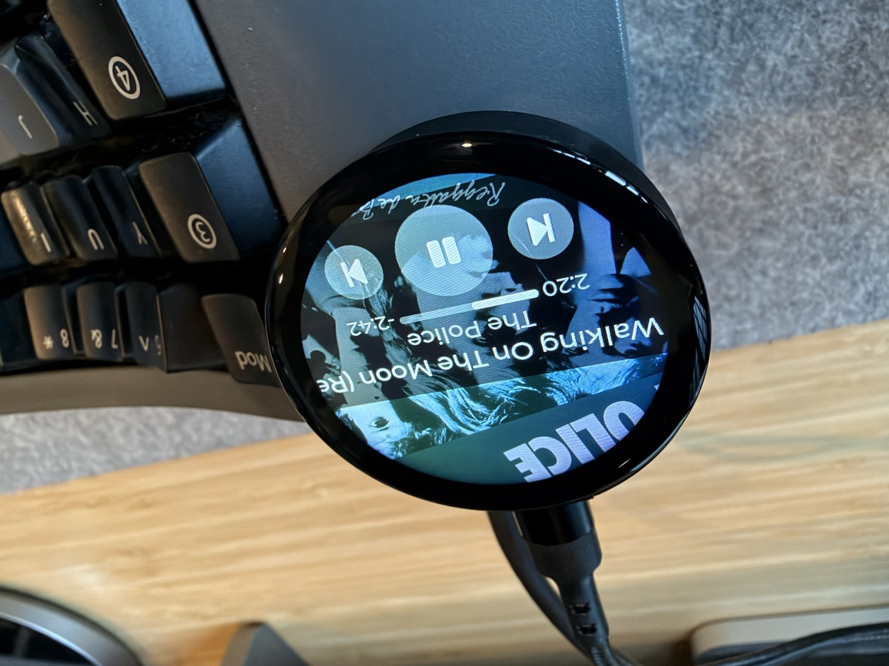

# Now Playing Device

A macOS "now playing" display for a small round ESP32 screen. Shows album art, track info, progress, and playback controls — connected over USB.



> **This is the source repo.** If you just want to set up the device (download the prebuilt firmware and Mac app), head to **[www.gxlabs.co/now-playing](https://www.gxlabs.co/now-playing)**.

## How it works

```
┌───────────┐  USB serial    ┌────────────────┐  /usr/bin/python3  ┌──────────────────┐
│   ESP32   │ ◄────────────  │  Menu bar app  │ ◄────────────────  │ Apple Music      │
│ + display │ ─────────────► │   (Mac side)   │ ─────────────────► │  / Spotify, etc  │
└───────────┘  touch cmds    └────────────────┘  media controls    └──────────────────┘
```

The Mac reads now-playing metadata via the bundled [`MediaRemoteAdapter.framework`](https://github.com/ungive/mediaremote-adapter), loaded in-process by `/usr/bin/python3` (a `com.apple.*`-signed binary — macOS 15.4+ only authorizes the private MediaRemote framework for callers with an Apple bundle id, so the bundled py2app Python can't reach it directly). Artwork is converted to RGB565 and pushed to the ESP32 over USB serial; touch input on the display sends prev/toggle/next commands back. The device declares its own panel size in the USB handshake, so one build of the Mac app drives either board.

## Hardware

Two boards are supported. The firmware picks the right one from the build target; the UI is authored against the 240px panel and scaled from there (see `main/board.h`).

**Seeed XIAO ESP32-C6** (`idf.py set-target esp32c6`)

- [Seeed XIAO ESP32-C6](https://www.seeedstudio.com/Seeed-Studio-XIAO-ESP32C6-p-5884.html)
- [Seeed Round Display for XIAO](https://www.seeedstudio.com/Seeed-Studio-Round-Display-for-XIAO-p-5638.html) (GC9A01A 240x240 SPI + CHSC6X touch)

**Waveshare ESP32-S3-Touch-LCD-1.46** (`idf.py set-target esp32s3`)

- [ESP32-S3-Touch-LCD-1.46](https://www.waveshare.com/wiki/ESP32-S3-Touch-LCD-1.46) — ESP32-S3R8, 16MB flash, 8MB octal PSRAM
- SPD2010 412x412 round IPS over QSPI, SPD2010 capacitive touch over I2C
- Both reset lines hang off an onboard TCA9554 expander, so `boards/ws_s3_bus.c` releases them before the panel and touch drivers come up
- The screen runs with the USB-C connector at the top. Flip `BOARD_FLIP_180` in `main/boards/ws_s3_bus.h` to mount it the other way up (panel and touch flip together)

## Building the menu bar app

Produces a self-contained `NowPlayingDisplay.app` with the vendored `MediaRemoteAdapter.framework` — driven via `/usr/bin/python3` and `ctypes`. No Homebrew or external CLI required at runtime.

```bash
python3 -m venv .venv
source .venv/bin/activate
pip install -r requirements.txt py2app
python setup.py py2app

# sign nested code (depth-first), then frameworks, then main app
SIGN="Developer ID Application: YOUR NAME (TEAMID)"
APP="dist/NowPlayingDisplay.app"
ENT="entitlements.plist"

find "$APP" -type f \( -name "*.so" -o -name "*.dylib" \) -print0 | \
  xargs -0 -n1 codesign --force --options runtime --timestamp --sign "$SIGN"

# Python.framework's main binary has no extension and is missed by the find above
codesign --force --options runtime --timestamp --entitlements "$ENT" --sign "$SIGN" \
  "$APP/Contents/Frameworks/Python.framework/Versions/3.13/Python"
codesign --force --options runtime --timestamp --sign "$SIGN" "$APP/Contents/Frameworks/Python.framework"

# Bundled MediaRemoteAdapter framework
FW="$APP/Contents/Resources/vendor/mediaremote-adapter/Frameworks/MediaRemoteAdapter.framework"
codesign --force --options runtime --timestamp --sign "$SIGN" "$FW/Versions/A/MediaRemoteAdapter"
codesign --force --options runtime --timestamp --sign "$SIGN" "$FW"

# Main executables (with hardened runtime entitlements for Python)
codesign --force --options runtime --timestamp --entitlements "$ENT" --sign "$SIGN" "$APP/Contents/MacOS/python"
codesign --force --options runtime --timestamp --entitlements "$ENT" --sign "$SIGN" "$APP/Contents/MacOS/NowPlayingDisplay"
codesign --force --options runtime --timestamp --entitlements "$ENT" --sign "$SIGN" "$APP"

# package as a signed/notarized .dmg with drag-to-Applications layout
DMG="dist/NowPlayingDisplay.dmg"
create-dmg \
  --volname "NowPlayingDisplay" \
  --window-size 600 350 \
  --icon-size 100 \
  --icon "NowPlayingDisplay.app" 150 200 \
  --app-drop-link 450 200 \
  --no-internet-enable \
  "$DMG" "$APP"

codesign --force --sign "$SIGN" "$DMG"
xcrun notarytool submit "$DMG" --keychain-profile "your-profile" --wait
xcrun stapler staple "$DMG"
```

`entitlements.plist` (already in repo) grants the hardened runtime exceptions Python needs (`disable-library-validation`, `allow-unsigned-executable-memory`).

Open `dist/NowPlayingDisplay.dmg`, drag `NowPlayingDisplay.app` to `/Applications`, and launch it. Auto-detects the ESP32 via USB handshake and reconnects if unplugged/replugged.

## Firmware

Requires [ESP-IDF](https://docs.espressif.com/projects/esp-idf/en/stable/get-started/) v5.1+ (v5.5 for the ESP32-S3 board).

```bash
cd firmware/esp-idf

# Waveshare ESP32-S3-Touch-LCD-1.46
idf.py set-target esp32s3
idf.py build flash

# ...or Seeed XIAO ESP32-C6 + Round Display
idf.py set-target esp32c6
idf.py build flash
```

`set-target` regenerates `sdkconfig` from `sdkconfig.defaults` plus the matching `sdkconfig.defaults.<target>`, so switching boards means re-running it. Console logging goes to UART0 — USB serial belongs to the data protocol.

On first boot the display shows a QR code. Once the Mac-side app connects, it switches to the now-playing UI.

## Updating the vendored adapter

```bash
git clone --depth 1 --branch vX.Y.Z https://github.com/ungive/mediaremote-adapter.git /tmp/mra
cd /tmp/mra && mkdir build && cd build && cmake .. && cmake --build .
cp -R MediaRemoteAdapter.framework <repo>/vendor/mediaremote-adapter/Frameworks/
cp ../LICENSE                      <repo>/vendor/mediaremote-adapter/LICENSE
echo "$(git rev-parse HEAD)\n$(git describe --tags)" > <repo>/vendor/mediaremote-adapter/VERSION
```

## USB protocol

The Mac and ESP32 communicate over USB serial with a simple binary protocol:

| Direction | Header | Payload |
|-----------|--------|---------|
| Mac → ESP | `0x00` | Ping (ESP responds `NP:ACK:<art size>\n`, e.g. `NP:ACK:412`) |
| Mac → ESP | `0x01` + 2-byte BE length | JSON state |
| Mac → ESP | `0x02` + 4-byte BE length | RGB565 artwork, square, sized to the panel |
| Mac → ESP | `0x03` | Heartbeat (separate from state, sent every 1s so a stalled MediaRemote query doesn't trigger the disconnect watchdog) |
| ESP → Mac | `CMD:<action>\n` | Touch command (toggle/next/previous) |

## Credits

This project would not be possible without [ungive/mediaremote-adapter](https://github.com/ungive/mediaremote-adapter), which provides the Apple-signed bridge into the private MediaRemote framework on macOS 15.4+. Huge thanks to [@ungive](https://github.com/ungive) for building and maintaining it.

## Gratuity

If this project saved you some time or made your desk a little nicer, you can support further work at [buymeacoffee.com/gxlabs](https://buymeacoffee.com/gxlabs).

<a href="https://buymeacoffee.com/gxlabs"></a>
